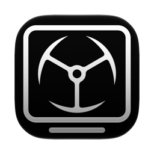

<p align="center">
  
</p>

<h1 align="center">Imperator CRT Overlay</h1>

<p align="center">A macOS menu bar app that lays a live CRT and VHS effect over your screen.</p>

## What it is

The app draws a transparent overlay on top of everything else: scanlines, screen curvature,
vignette, flicker, RGB fringing, tape noise and jitter. The overlay is rendered in Metal at
30fps and ignores the mouse, so you keep working underneath it.

Everything lives in the menu bar. There is no Dock icon and no window to manage.

- Ten effect sliders, plus a master intensity
- Built-in presets, and your own saved on top of them
- Per display: turn the overlay on for one screen and leave the others alone
- Stays put through Mission Control, Spaces and Show Desktop
- Open at Login toggle

Requires macOS 13 or later, Apple silicon. Built and tested on macOS 27 only, older versions
are expected to work but have not been verified.

Install at your own risk. The app is not notarized and carries no Apple Developer signature,
so macOS cannot vouch for it. It is provided as is, with no warranty, under the MIT license.

## Install

Download the zip from [Releases](https://github.com/goranimperator/imperator-crt-overlay/releases),
unpack it, and drag `Imperator CRT Overlay.app` into `/Applications`.

The app is ad-hoc signed, so Gatekeeper blocks the first launch. Right-click the app and
choose Open, then Open again in the dialog. Or clear the quarantine flag yourself:

```bash
xattr -dr com.apple.quarantine "/Applications/Imperator CRT Overlay.app"
```

## Permissions

None. The overlay is an ordinary borderless window that passes mouse events through, so the
app needs no Accessibility, Screen Recording or Automation grant. Open at Login uses
`SMAppService`, which registers the app with the system without a permission prompt.

## Use

Click the menu bar icon to open the panel.

| Control | What it does |
| --- | --- |
| Header switch | Turns the overlay on and off |
| Intensity | Master strength for every effect below |
| Scanlines | Horizontal line darkness |
| Vignette | Corner falloff |
| Flicker | Brightness wobble over time |
| Noise | Static grain |
| Curvature | Barrel distortion, as on a real tube |
| RGB Dark | Shadow mask darkening between phosphor stripes |
| RGB Color | Colour separation across the stripes |
| VHS | Tape smear and chroma bleed |
| Static | Horizontal jump and tearing |
| Size | Overscan, shrinking the image inside the tube |
| Screens | One switch per display |
| Presets | Built-in looks, plus anything you save |

Settings are written to `UserDefaults` under `crt.*` keys and survive a restart.

## Build

No Xcode project. The app is compiled with `swiftc` from a Makefile.

```bash
make build
```
```bash
make run
```
```bash
make clean
```

The build stamps the binary with the current SDK while keeping the deployment target at
macOS 13:

```
minos 13.0
  sdk 27.0
```

Both halves matter. AppKit picks which generation of a control to draw from the `sdk` field
in `LC_BUILD_VERSION`, not from the macOS it is running on, so a binary stamped with an old
SDK draws old switches and old popover chrome forever. The `minos` half is what lets the app
launch at all below macOS 27: without an explicit `-target`, swiftc stamps the minimum with
the toolchain's own version, which would have made the app refuse to start on the macOS 13
this `Info.plist` advertises. `-platform_version` then pins the SDK rather than leaving it to
the linker default. Check both with:

```bash
otool -l "build/Imperator CRT Overlay.app/Contents/MacOS/CRTImperator" | grep -A4 LC_BUILD_VERSION
```

Ad-hoc codesigning runs as part of `make build` and is not optional. Without it Gatekeeper
refuses the bundle outright.

## Release

```bash
make dist VERSION=x.y.z
```

Builds the app, stamps the version into the built bundle, re-signs it and writes
`dist/Imperator-CRT-Overlay-x.y.z.zip`. It touches nothing in git.

```bash
make release VERSION=x.y.z
```

Bumps `Info.plist`, commits, tags `vx.y.z`, pushes, and publishes the GitHub release with the
zip attached. It refuses to run on a dirty working tree. Release notes come from
`release-notes.md`.

## Layout

Six Swift files, no external dependencies.

| File | What is in it |
| --- | --- |
| `Sources/main.swift` | Entry point. Builds `NSApplication` and the delegate by hand, no `@main` |
| `Sources/AppDelegate.swift` | Metal device, one overlay window per screen, forced dark mode, accent override, screen and Space change handling |
| `Sources/OverlayWindow.swift` | Borderless transparent `NSPanel`, mouse-passthrough, maximum window level, `.stationary` |
| `Sources/CRTMetalView.swift` | `MTKView` subclass that renders the effect. The Metal shader is an inline string, and its `Uniforms` struct must stay field-for-field in sync with the Swift one |
| `Sources/CRTSettings.swift` | `CRTSettings.shared`, persistence to `UserDefaults`, presets, change notifications |
| `Sources/StatusBarController.swift` | The whole UI: status item, popover, SwiftUI views, About panel |

Checks used during development live in `scripts/`. They are plain Node and take no
dependencies:

```bash
node scripts/check-toggles.mjs
```
```bash
node scripts/check-background.mjs
```

`check-background.mjs` compiles the app's own popover view, renders it to a bitmap, and
proves it paints nothing of its own, so the popover shows the standard macOS material.

## Known limits

- Apple silicon only. The Makefile builds one architecture, the host's.
- The overlay redraws at a fixed 30fps and is not frame rate aware.
- Effect parameters are global. Per-screen settings cover on and off, nothing more.
- Not notarized, so every update needs the Gatekeeper right-click again.

## Third-party

None. AppKit, SwiftUI, Metal, MetalKit, QuartzCore and ServiceManagement only.

## App details

Bundle identifier `com.goranimperator.ImperatorCRTOverlay`. `LSUIElement` is true, which is
why there is no Dock icon.

## License

MIT. See [LICENSE](LICENSE).
